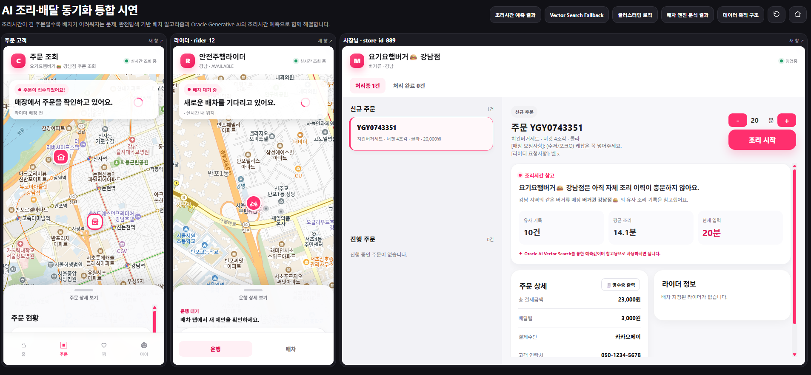
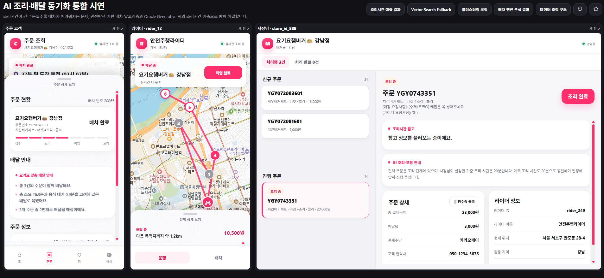
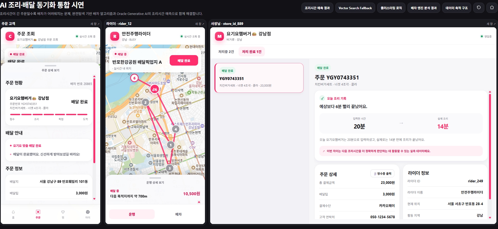

# 실속배달 — 조리시간 기반 배달 순서 최적화
> 요기요 x Oracle Hackathon (2026)

## 프로젝트 소개

동시에 접수된 여러 주문의 조리시간을 예측하고, 이를 반영해 라이더의 배달 순서를
최적화하는 시스템. "조리 완료 시점"까지 고려한 순서 최적화로 음식이 식지 않게,
라이더 동선은 효율적으로 만드는 것이 목표.

## 시연 화면

동일한 주문(YGY0743351)이 신규 접수부터 배달 완료까지 이어지는 흐름을
고객·라이더·사장님 세 화면에서 동시에 확인할 수 있다.

**1. 조리 시작 — 신규 매장 콜드스타트, Vector Search 참고정보 표시**


**2. 배차 완료 — 라이더 픽업 진행 중, 90가지 경로 탐색 결과 반영**


**3. 배달 완료 — 예측(20분) vs 실측(14분) 피드백, 다음 예측에 반영**


## 핵심 아이디어

1. 실시간으로 들어오는 주문을 Kafka로 스트림 처리하며 클러스터링
2. Redis Geo로 클러스터 근처 라이더 검색
3. Python 완전탐색으로 클러스터 내 배달 순서 스코어링 및 최적 순서 도출
4. Oracle AI Vector Search(23ai)로 과거 유사 주문 임베딩을 조회해 조리시간 예측 보정
5. Oracle Autonomous Database(ADB)에 주문/배차 데이터를 저장하고,
   배차 결과에 대한 설명을 LLM으로 생성해 프론트엔드에 제공

## 기술 스택

| 영역 | 기술 |
| --- | --- |
| 스트림 처리 | Kafka (KRaft 모드, Zookeeper 미사용) |
| 라이더 검색 | Redis (Geo 인덱스) |
| 순서 최적화 | Python (완전탐색 기반 스코어링) |
| 조리시간 예측 보정 | Oracle AI Vector Search (23ai) + Cohere Embed |
| 데이터베이스 | Oracle Autonomous Database (ADB, Developer Free) |
| 배차 결과 설명 생성 | LLM (OCI Generative AI, 사장님 화면 안내 문구 생성) |
| API 서버 | FastAPI |
| 프론트엔드 | Vite + React (역할별 화면을 렌더링하는 얇은 로더 구조) |
| 배치 처리 | cron + Python (Airflow 미사용 — 해커톤 규모 고려) |
| 인프라 | OCI Compute VM (Oracle Linux 8), VCN/Subnet/IGW 구성 |
| 컨테이너 | Docker (Kafka, Redis만 컨테이너화, 나머지는 VM에 직접 설치) |

## 아키텍처 흐름

```
주문 발생 → Kafka 스트림 처리 (클러스터링)
    ↓
Redis Geo로 근처 라이더 검색
    ↓
Sequencing Engine (완전탐색 순서 최적화)
    ↓
Oracle Vector Search로 조리시간 예측 보정
    ↓
Oracle Autonomous Database에 결과 저장
    ↓
LLM으로 배차 결과 설명 생성
    ↓
FastAPI로 최종 배달 순서 + 설명 반환
    ↓
프론트엔드에서 역할별(고객/사장님/라이더) 화면 표시
```

사장님의 조리시작·조리완료, 라이더의 배차수락·픽업·완료는 이 자동 파이프라인과는
별도로, FastAPI가 요청을 받아 즉시 Oracle ADB / Redis 상태를 갱신한다.

## 조리시간 예측 (Vector Search fallback)

콜드스타트(자체 조리 이력이 부족한 신규 매장) 문제를 Oracle AI Vector Search로
해결한다. 매장 상황(요일 · 시간대 · 동시주문 수 · 메뉴 구성)을 Cohere Embed로
1024차원 벡터화하고, 아래 단계로 검색 범위를 넓혀가며 유사 사례를 찾는다.

1. 자체 매장 이력
2. 같은 지역 + 같은 브랜드
3. 타 지역 + 같은 브랜드
4. 같은 지역 + 같은 카테고리 (다른 브랜드)
5. 카테고리 전체 (지역 무관)

지역보다 브랜드를 fallback 우선순위로 둔 이유: 같은 지역이라도 브랜드가 다르면
조리법·메뉴 구성·주방 동선이 달라 참고가 약한 반면, 타 지역이라도 같은 브랜드면
조리법과 매뉴얼이 동일해 더 유효한 참고값이 된다. 실제 조리완료 시각은 매 주문마다
`vector_cases`에 새 사례로 쌓여 다음 예측의 근거가 된다.

## 디렉토리 구조

프로젝트 루트는 역할별로 `ygy-backend/`, `ygy-frontend/`로 나뉜다.

## 개발 환경

- OCI Compute VM (`ygy-team07-vm`, VM.Standard.E4.Flex, 4 OCPU/32GB, Oracle Linux 8)
  위에서 VS Code Remote-SSH로 작업
- Kafka, Redis는 Docker Compose로 실행
- Python 서비스(stream_processor, sequencing_engine, api, batch)는 VM에 직접
  설치해서 실행
- Oracle Autonomous Database는 Developer Free 옵션으로 생성해 사용
- Compartment: `HACK-TEAM-07`


## 구현 범위 / 스코프아웃

**구현 완료 **
- Kafka 기반 실시간 주문 처리, 클러스터링, 완전탐색 배차 경로 최적화
- Vector Search 5단계 fallback (실제 실행 및 검증 완료)
- 최소 수익 기준 미달 배차 필터링
- 조리시간 예측-실측 피드백 루프

**스코프 아웃**
- 라이더 거절/응답 시간 초과에 대한 후속 처리
- 여러 라이더 후보를 비교하는 로직 (현재는 최근접 1명 그리디 선택)
- correction_factor 정기 재계산 배치 (cron 스크립트는 있으나 스케줄 미가동)
- 대규모 주문(수백 건 이상 동시 처리) 대비 클러스터링 계산량 최적화
- 실시간 GPS 연동 (현재는 시뮬레이션)

## 팀

| 이름 | 역할 |
| --- | --- |
| 황윤정 | 백엔드 · 인프라 · 배차 알고리즘 · 실시간 스트림 처리 · 조리시간 예측 보정 (FastAPI, OCI, Kafka, Redis, ADB, Vector Search, Sequencing Engine) |
| 박준영 | 프론트엔드 설계 및 구현 · 고객/사장님/라이더 역할별 화면 UI/UX · 실시간 데이터 연동 · LLM 기반 배차 설명 설계 및 구현 (OCI Generative AI, 프롬프트, 응답 API) |